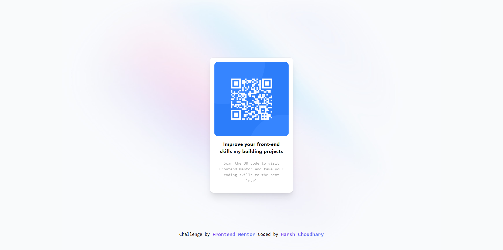

# QR Code Component

Check out the live demo [here](https://qr-codeharshx.netlify.app).

## Preview

  

📱 A QR Code Component built using React.js and Tailwind CSS.

## Description

🚀 This project was completed as a part of the QR Code Component challenge on Frontend Mentor. It allows users to generate and display QR codes for various purposes.

## Features

✨ Simple and easy-to-use UI for generating QR codes.
✨ Responsive design suitable for different screen sizes.
✨ Customizable options for QR code generation.
✨ Fast and efficient QR code rendering.

## Technologies Used

🔧 React.js
🎨 Tailwind CSS

## Usage

1. Clone the repository: `git clone https://github.com/HarshXch/qr-code-component.git`
2. Install dependencies: `npm install`
3. Run the development server: `npm start`

## Contributing

🤝 Contributions, issues, and feature requests are welcome! Feel free to check the [issues page](https://github.com/HarshXch/qr-code-component/issues).

## License

This project is licensed under the [MIT License](https://opensource.org/licenses/MIT).

## Acknowledgements

🙏 Special thanks to [Frontend Mentor](https://www.frontendmentor.io/) for providing the QR Code Component challenge.
